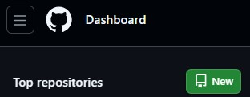
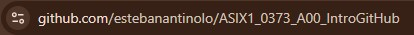
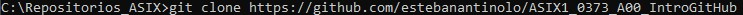
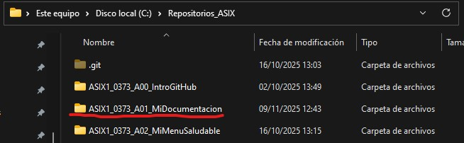

# MI DOCUMENTACIÓN DE **LENGUAJES DE MARCAS**

### ÍNDICE
1. GITHUB
2. MARKDOWN
3. HTML
4. CSS
5. DISEÑO RESPONSIVE

## _**GITHUB**_


### COMANDOS
Para empezar, vamos a conocer los comandos para vincular el repositorio de Github a nuestro local y poder trabajar a través de Visual Studio.

| COMANDO | FUNCIÓN |
| ------------------- | ------------------- |
| git clone (enlace) | Clonar el repositorio de github |
| git init | Inicializar visual studio con github |
| git add . | Añadir todos los archivos a zona de intercambio |
| git commit -m "(texto)" | Hacer commits |
| git push origin main | Subir a github los commits |

### COMO VINCULAR REPOSITORIO CON LOCAL

1. Primero, creamos un nuevo repositorio en Github si no tenemos uno.



2. Copiamos el enlace que nos sale al entrar al repositorio.



3. Nos situamos en el cmd y en el direcotrio donde queremos tener nuestro repositorio. Ejecutamos el comando git clone (enlace) y se nos duplicará.



4. Para comprobarlo, vamos al explorador de ficheros y comprobamos que se nos ha creado una carpeta con el nombre del repositorio.



## _**MARKDOWN**_

Mardown es un lenguaje de marcas básico, las extensiones pueden ser:

    * md
    * mkd
    * mkdown
    * text
    * mdown

### ETIQUETAS BÁSICAS

#### ENCABEZADOS

Para los encabezados usamos las almoadillas (#).

```# H1 ```
# ENCABEZADO 1

```## H2```
## ENCABEZADO 2

...

```###### H6```
###### ENCABEZADO 6

#### ESTILOS DE LETRA

Para la cursiva, escribiremos entre dos asteriscos (*) o dos barras bajas (_) el texto.

*Este texto esta en crusiva*

Para la negrita, escribiremos entre dos asteriscos al principio y dos al final (**) o dos barras bajas al principio y dos al final (__) el texto.

**Este texto esta en negrita**

#### LISTAS

Para las listas **ordenadas** lo haremos a través de los números.

```
1. Elemento 1
2. Elemento 2
    1. Subelemento 2.1
3. Elemento 3
```

Resultado:

1. Elemento 1
2. Elemento 2
    1. Subelemento 2.1
3. Elemento 3

Para las listas **desordenadas** listaremos los elementos con asteriscos (*), guiones (-) o símbolo de suma (+).

```
* Elemento 1
+ Elemento 2
- Elemento 3
```

Resultado:

* Elemento 1
+ Elemento 2
- Elemento 3

#### PÁRRAFOS Y BLOQUES DE CÓDIGO

Para los párrafos simplemente se empieza a escribir en una línea en blanco. Para mostrar bloques códigos de manera literal, marcaremos al principio y al final del código con tres acentos abiertos (```).

Ejemplo:

```html
<html>
    <head>

    </head>
</html>
```

#### ENLACES E IMAGENES

Para añadir enlaces lo hacemos de la siguiente manera:

```
[Texto](http://enlace)
```

Para añadir imagenes lo hacemos de la siguiente manera:

```

```

#### TABLAS

Para establecer las columnas de una tabla crearemos tantos espacios con barras (|) como columnas queramos. Seguidamente, debajo repetiremos el patrón de barras, pero entre los huecos añadiremos guiones para hacer el hueco de la celda mas grande. Dependiendo donde pongamos los (:), únicamente en la fila de los guiones, el texto de todas las celdas de esa columna se alinearan en una posición u otra

```
| Columna 1 | Columna2 | Columna3 |
|-------------------|:-------------------:|-------------------:|
```

| Columna 1 | Columna2 | Columna3 |
|------------------------|:------------------------:|------------------------:|
|alineado izquierda|centrado|alineado derecha|

##  _**HTML**_

Para abrir un elemento usaremos los siguientes símbolos <nombre_etiqueta> y para cerrarlo </nombre_etiqueta>.

La estrucutra general de htlm es la siguiente

```
<!DOCTYPE html>
<html>
    <head>
        <meta charset="utf-8">
        <title> Pagina principal </title>
    </head>
    <body>

    *Contenido de la página* 

    </body>
</html>
```

Para añadir un comentario al código lo haremos de la siguiente manera

```
<!--comentario-->
```

### ETIQUETAS BÁSICAS

Para añadir un parrafo:
```
<p> Texto </p>
```

Para añadir un salto de línea:
```
<br>
```

Para añadir una línea horizontal separatoria:
```
<hr>
```

Para dar enfasis al texto:
```
<strong>texto</strong>
```

Para crear un contenedor en linea:
```
<span>Contenido</span>
```

Lista ordenada:
```html
<ol>
    <li> Elemento 1 </li>
    <li> Elemento 2 </li>
</ol>
```
Resultado:

<ol>
    <li> Elemento 1 </li>
    <li> Elemento 2 </li>
</ol>

Lista desordenada:
```html
<ul>
    <li> Elemento desordenado 1 </li>
    <li> Elemento desordenado 2 </li>
</ul>
```
Resultado:

<ul>
    <li> Elemento desordenado 1 </li>
    <li> Elemento desordenado 2 </li>
</ul>

Para añadir imagenes:
```

```

Rutas relativas y asbolutas:
* Relativa: Cuando accedes al archivo desde el sitio donde estas.

* Absoluta: Cuando accedes al archivo desde el disco local, sin importar el sitio donde estas.

### CONTENEDORES, FORMULARIOS Y TABLAS

#### CONETENEDOR (DIV)

Es una caja que sirve para agrupar elementos en una página web, un bloque donde puedes poner texto, iamgenes, tablas...

#### FORMULARIO

Etiquetas:
```
<form> --> para indicar donde irá el formulario
<label> --> sirve para mostrar un texto descriptivo que acompaña a un campo del formulario.
<input type="text"> --> crea un campo de texto donde el usuario puede escribir información.
<fieldset> --> agrupa varios campos relacionados dentro del formulario.
<legend> ->> es el título o descripción de un grupo de campos dentro de un <fieldset>.
<input type="radio"> --> crea un botón de selección única (solo se puede elegir una opción dentro del mismo grupo).
<input type="checkbox"> --> crea casillas de verificación que permiten seleccionar varias opciones a la vez.
<select> --> crea un menú desplegable con distintas opciones.
<option> --> define cada una de las opciones que aparecen dentro del menú desplegable.
<textarea> --> crea un cuadro de texto grande donde el usuario puede escribir varias líneas.
<button type="submit"> --> crea un botón que envía los datos del formulario al destino indicado en el <form>.
```

Ejemplo:

    <form action="URLdeDestino.html" method="GET" target="_blank">
        
        <label for="username">Username:</label>
        <input type="text" name="username" id="username" required>
        
        <br>
        
        <label for="realname">Nombre real:</label>
        <input type="text" name="realname" id="realname">

        <br>

        <fieldset>
            <legend>Carnet de conducir</legend>
            <label for="carnetsi">SI:</label>
            <input type="radio" name="carnet" value="carnetsi" id="carnetsi">
            <label for="carnetno">NO:</label>
            <input type="radio" name="carnet" value="carnetno" id="carnetno">
        </fieldset>

        <br>

        <fieldset>
            <legend>Gustos musicales</legend>
            <label for="POP">POP:</label>
            <input type="checkbox" name="musica[]" value="pop" id="pop">
            <label for="HEAVY">HEAVY:</label>
            <input type="checkbox" name="musica[]" value="heavy" id="heavy">
            <label for="PACHANGA">PACHANGA:</label>
            <input type="checkbox" name="musica[]" value="pachanga" id="pachanga">
        </fieldset>

        <label for="nacionalidad">Nacionalidad:</label>
        <select id="nacionalidad" name="nacionalidad">
            <option value="espana">España</option>
            <option value="USA">USA</option>
            <option value="brasil">Brasil</option>
        </select>

        <br>
        <label for="observaciones">Observaciones:</label>
        <br>
        <textarea name="observaciones" id="observaciones" rows="5" cols="30" placeholder="Introduce aquí cualquier observación que tengas"></textarea>

        <br>

        <button type="submit" name="enviar" value="enviar">Enviar formulario</button>
    </form>

#### TABLA

Etiquetas:
```
<table> --> para crear una tabla.
border="1" --> para añadir un borde alrededor de la tabla.
<thead> --> para indicar la parte superior de la tabla, donde están los encabezados.
<tr> --> para crear una fila dentro de la tabla.
<th> --> para crear una celda de encabezado (en negrita).
<tbody> --> para indicar el cuerpo principal de la tabla.
<td> --> para crear una celda de datos.
rowspan="2" --> para hacer que una celda ocupe dos filas.
colspan="2" --> para hacer que una celda ocupe dos columnas.
<tfoot> --> para indicar el pie de la tabla.
<caption> --> para añadir un título o descripción breve a la tabla.
```

Ejemplo:

    <table border="1">
        <thead>
            <tr>
                <th>ORDEN</th>
                <th>ATLETA</th>
                <th>TIEMPO</th>
            </tr>
        </thead>


        <tbody>
            <tr>
                <td>1</td>
                <td>Michael Eaton</td>
                <td>2:23:01</td>
            </tr>

            <tr>
                <td rowspan="2">2</td>
                <td colspan="2">Juan Carlos</td>
            </tr>

            <tr>

                <td>Jesus Canto</td>
                <td>2:50:02</td>
            </tr>

        </tbody>


        <tfoot>

            <tr>
                <td>ORDEN</td>
                <td>ATLETA</td>
                <td>TIEMPO</td> 
            </tr>

        </tfoot>
    </table>
    <caption>Tabla clasificatoria de maratón</caption>


